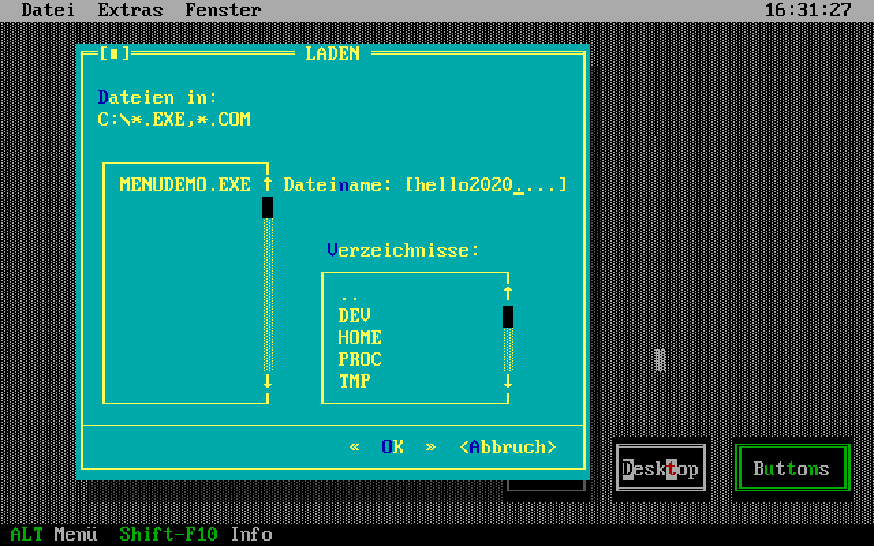

# Application Services (ASV)

Application Services (ASV) is a library ("unit" or module) for [Turbo Pascal](https://en.wikipedia.org/wiki/Turbo_Pascal)
5.0 and 5.5 to easily create a text-based UI (roughly based on [SAA](https://en.wikipedia.org/wiki/IBM_Systems_Application_Architecture) / [CUA](https://en.wikipedia.org/wiki/IBM_Common_User_Access)).
It offered procedures/functions for pull-down and pop-up menus, alert and dialog boxes that could be operated either by
a Microsoft compatible mouse (yes, with a text cursor!) or by hotkeys.

ASV actually was the first software that I sold commercially after founding my first company in 1990, called Soft*design*
(before I renamed it to "muchsoft" later on, a name that I was already using in the mid-1980s).

The library was written in a procedural style. Object-oriented concepts weren't available until Turbo Pascal 5.5.
Borland shipped the [Turbo Vision](https://en.wikipedia.org/wiki/Turbo_Vision) library with TP 5.5, making ASV
kind of superfluous. (Turbo Vision itself was superseded by the [Object Windows Library](https://en.wikipedia.org/wiki/Object_Windows_Library),
which I took as an inspiration for [ObjectGEM](https://github.com/thmuch/objectgem).)

ASV was developed in 1990/1991 (and abandoned pretty soon afterwards).


## Usage

```pascal
program XYZ;
  uses asv;

  ...

begin
  ...
end.
```


## Demo

Go and try the "offical" [demo application here](https://thmuch.github.io/application-services/)
(running on [js-dos](https://github.com/caiiiycuk/js-dos) &#x1F603;).




## Disclaimer

This source code is completely out of date. It is provided as-is without any warranty.

I publish the source files for historical / archaeological reasons only, for informational purposes.
The code is not intended to be used any more, especially not as a template for new code.


## Please note

Some parts of the code (some names, some comments) and all of the documentation are in German only. Sorry for that.

That being said:

Have fun! :-)

Thomas\
@thmuch
